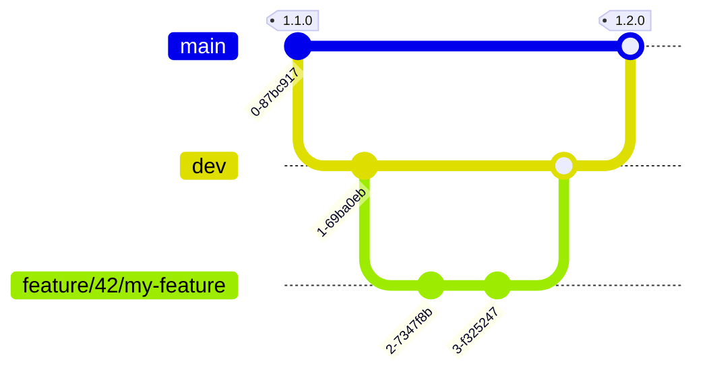

# 🤝 Contributing

Thank you for taking the time to contribute! This guide is a good starting point, whether you are filing your first bug report or opening a pull request.

## 🙋 What Can I Contribute?

Every kind of contribution counts. Pick the one that matches your time and experience:

| I want to... | Issue template | Where to start |
| :--- | :--- | :--- |
| Report a bug | 🐛 Bug Report | [Reporting a Bug](#-reporting-a-bug) |
| Suggest an improvement | 💡 Feature Request | [Requesting a Feature](#-requesting-a-feature) |
| Fix an open issue | - | [Fixing Something](#-fixing-something) |
| Improve the documentation | - | [Improving the Documentation](#-improving-the-documentation) |
| Integrate a new IAM source | 🧩 Plugin Proposal | [Adding a Plugin](#-adding-a-plugin) |
| Restructure core code | 💡 Feature Request | [Refactoring the Core](#️-refactoring-the-core) |

> 💡 **Tip:** The issue templates live in `.github/ISSUE_TEMPLATE/` and are offered automatically when you open a new issue on GitHub.

**🚦 Before You Start**

- **Read the documentation first.** The [documentation](https://apizee.github.io/assets-guardian/) covers the architecture, the plugin system, and the configuration, most questions are already answered there.
- **Search.** Check the existing issues and PRs to avoid duplicates.
- **One concern per issue/PR.** Mixing unrelated changes makes review harder and slows merging.
- **Discuss before large changes.** If you plan a significant refactor or new feature, open an issue first so we can align before you invest time coding.

### 🐛 Reporting a Bug

1. **Check** that the bug has not already been reported.
2. **Gather** the following information:
   - Steps to reproduce (exact commands, inputs, config snippets without credentials)
   - Expected behaviour vs. actual behaviour
   - Logs (if any)
   - Your environment: how you run Assets Guardian (Docker container or standalone install launched from the command line on the host), the host OS, and the Assets Guardian version (`uv run assets-guardian --version`)
3. **Open an issue** with the **🐛 Bug Report** template, it prompts for every detail above and applies the `bug` label automatically.

> 💡 **Tip:** A minimal reproduction case, the smallest possible config or command that triggers the bug, is the most helpful thing you can include.

### 💡 Requesting a Feature

1. **Describe the problem** you are trying to solve, not just the solution you have in mind.
2. **Explain your use case** so maintainers can understand the value and scope.
3. **Propose a solution** (optional but helpful). Sketches, diagrams, or pseudo-code are all welcome.
4. **Open an issue** with the **💡 Feature Request** template, it structures all of the above and applies the `enhancement` label automatically.

### 🔧 Fixing Something

1. **Pick an issue.** Browse the open issues, those labelled `good first issue` are ideal entry points, and `help wanted` marks issues where maintainers would appreciate assistance.
2. **Claim it.** Leave a comment on the issue saying you are working on it, so nobody duplicates your effort.
3. **Reproduce the bug locally** before touching any code. If you cannot reproduce it, ask for more details on the issue.
4. **Write a failing test first** when the fix touches the core, then make it pass (see [Code Quality](#-code-quality)).
5. **Follow the code workflow:** branch `fix/<issue-ref>/<short-description>`, commit as `fix(<scope>): ...`, then open a PR (see [Contributing Code](#-contributing-code)).

> 💡 **Tip:** Small, focused fixes are reviewed and merged the fastest. Resist the urge to clean up unrelated code in the same PR.

### 📖 Improving the Documentation

Documentation contributions are as valuable as code, and they are a great way to get familiar with the project:

- **Typos, broken links, clarifications:** submit a PR directly with a `docs` branch type, no issue needed.
- **New guides or restructuring:** open an issue first to agree on scope and placement.
- **Docstrings** count as documentation too, see [Code Documentation](#️-code-documentation) for the expected format.

See [Contributing Documentation](#-contributing-documentation) below for how to build and preview the docs locally.

### 🧩 Adding a Plugin

Plugins connect Assets Guardian to a new IAM source (GitLab, Microsoft 365, Dolibarr, etc.) without modifying the core, thanks to the registry-based architecture.

1. **Always open an issue first** with the **🧩 Plugin Proposal** template, announcing the source you want to integrate, so maintainers can confirm nobody is already working on it and flag any known pitfalls.
2. **Read the [Plugin Development Guide](docs/markdown/PLUGIN.md).** It walks through the architecture, every interface, and a complete example.
3. **Start from the template**: copy `src/assets_guardian/plugins/_template/` and adapt it.
4. **Implement the two required components**: an `IClientProvider` in `client.py` and a `Collector` in `collector.py`, the only modules the discovery engine imports by name. In practice you also write an `IRepository` and an `IMapper`, which your collector wires together itself. Then add the optional ones your source needs (`ISheetBuilder`, `IRule`, `IPDFBuilder`).
5. **Validate your plugin** against the *Testing & Validation Checklist* at the end of the Plugin Development Guide, and exercise it end-to-end with the `check`, `sync`, and `audit` commands.

> ⚠️ **Warning:** Plugins are exempt from unit-test coverage requirements, but they must still pass all lint, format, and type checks.

### 🏗️ Refactoring the Core

The core follows a hexagonal architecture (ports and adapters) and is held to **100 % test coverage**. Well-scoped refactors are welcome, but the bar is deliberately high:

1. **Always open an issue first.** Core refactors affect every plugin and command, align with maintainers before investing time.
2. **Read the [Software Architecture Documentation](docs/markdown/ARCHITECTURE.md)** to understand the existing boundaries (domain, ports, registries, dependency injection), a good refactor reinforces them, it does not blur them.
3. **No behaviour change**: a `refactor` commit must keep the existing tests green, only restructure tests when the code layout they mirror moves.
4. **Keep coverage at 100 %** (see [Code Quality](#-code-quality)).
5. **Prefer a series of small, incremental PRs** over one big-bang rewrite, each step reviewable and independently revertable.

## 💻 Contributing Code

### 🌳 Branching Model

The repository has two long-lived branches:

| Branch | Role |
| :--- | :--- |
| `dev` | Integration branch. **All contributions land here**, via PR. |
| `main` | Stable, released code. Only receives `dev`, merged by a maintainer at release time. |



The rules, in order:

1. **Always create your working branch from an up-to-date `dev`**, never from `main`:

   ```bash
   git fetch origin
   git switch -c feature/42/my-feature origin/dev
   ```

2. **Every PR targets `dev`.** A PR opened against `main` will be re-targeted or closed by a maintainer, the only PR allowed to target `main` is the release PR from `dev`, opened by a maintainer.
3. **Only maintainers can approve and merge PRs** (enforced through branch protection and code owners).
4. **Maintainers cut releases:** they bump the version, merge `dev` into `main`, and tag (see [Release Process](#-release-process)).

### 🛠️ Set Up Your Environment

Follow the [**Getting Started guide**](docs/markdown/GETTING_STARTED.md) to set up your development environment.

### 🌿 Branch Naming

Branches follow the pattern `<type>/<issue-ref>/<short-description>`:

The `<issue-ref>` can be a **Jira ticket key** (e.g. `ABC-123`) or a **GitHub issue number** (e.g. `42`). It is optional when there is no associated ticket.

| Branch type | Example |
| :--- | :--- |
| New feature | `feature/42/gitlab-token-refresh` |
| Bug fix | `fix/ABC-210/missing-user-sync` |
| Hot fix | `hotfix/ABC-402/critical-mapping-bypass` |
| Refactor | `refactor/simplify-rule-engine` |
| Tests | `test/unit-coverage-core` |
| Documentation | `docs/ABC-415/update-architecture` |
| Chore / maintenance | `chore/upgrade-dependencies` |

*Rules*: **lowercase** and **hyphens only**.

### 📝 Commit Messages

This project enforces [Conventional Commits](https://www.conventionalcommits.org/). The pre-commit hook will reject messages that do not match.

**Format:**

```text
<type>(<scope>): <short description>
```

> 💡 **Tip:** You can add an optional body (why, not what), but we prefer simple, single-line commits.

**Allowed types:**

| Type | When to use |
| :--- | :--- |
| `feat` | A new feature |
| `fix` | A bug fix |
| `docs` | Documentation changes only |
| `refactor` | Code restructuring, no behaviour change |
| `test` | Adding or improving tests |
| `perf` | Performance improvement |
| `chore` | Tooling, dependencies, CI |
| `style` | Formatting / whitespace (no logic change) |
| `build` | Build system changes |
| `ci` | CI/CD pipeline changes |
| `revert` | Reverting a previous commit |

**Examples:**

```text
feat(gitlab): add oauth token refresh on expiry
```

```text
fix(rules): skip disabled rules instead of raising an error
```

```text
docs(plugin): add walkthrough for custom connector
```

**Breaking changes**, add `!` after the type:

```text
feat(config)!: rename `instances` key to `connectors`
```

> 💡 **Tip:** If the hook rejects your commit, read the error message, it tells you exactly what is wrong with the format.

### ✅ Code Quality

All checks run automatically via pre-commit. You can also run them manually with `make`:

```bash
# Lint check with ruff (no modification)
make lint-check
# equivalent to: uv run ruff check src/ tests/

# Format check with ruff (no modification)
make lint-format
# equivalent to: uv run ruff format --check src/ tests/

# Static type checking
make lint-type
# equivalent to: uv run mypy --config-file=pyproject.toml

# Cyclomatic complexity (fails at grade C or above)
make lint-complexity
# equivalent to: uv run radon cc src/ -a -s && uv run radon cc src/ -n C -s --no-assert

# Run tests with coverage report (HTML output in htmlcov/)
make test-coverage
# equivalent to: uv run pytest --cov --cov-report=html --cov-report=term-missing

# Security scan
make security-bandit
# equivalent to: uv run bandit -c pyproject.toml -r src/

# Dependency vulnerability audit (pip-audit)
make security-dependency-audit
# equivalent to: uvx pip-audit --vulnerability-service pypi -r requirements-audit.txt --require-hashes --disable-pip

# Secret scanning (gitleaks via pre-commit)
make security-gitleaks
# equivalent to: uv run pre-commit run gitleaks --all-files

# Dockerfile linting (hadolint)
make security-hadolint
# equivalent to: docker run --rm -v $(shell pwd)/Dockerfile:/Dockerfile:ro hadolint/hadolint:v2.14.0-debian hadolint /Dockerfile

# Trivy image scan
make security-trivy
# equivalent to: docker run --rm -v /var/run/docker.sock:/var/run/docker.sock -v trivy-cache:/root/.cache/trivy -v $(shell pwd)/.trivyignore.yml:/.trivyignore.yml:ro aquasec/trivy:0.58.2 image --exit-code 1 --scanners vuln --severity HIGH,CRITICAL --ignorefile /.trivyignore.yml --show-suppressed assets-guardian
```

> 💡 **Tip:** To run all these tests at once, you can use: `make all`.

#### 🐍 Pytest Details

- Coverage must stay at **100 %** for the core application.
- **Exemption:** The following are entirely exempt from unit testing and coverage requirements:
  - The `plugins/` directory.
  - The Excel/PDF reporting adapters: `core/reporting/excel/` and `core/reporting/pdf/`.
  - The Excel/PDF specific engine, ports and registries: `excel_engine.py`, `sheet_builders.py`, `pdf_builders.py`, `sheet_builder_registry.py` and `pdf_builder_registry.py`.
- New core features must ship with unit tests.
- Core bug fixes should include a test that reproduces the bug before the fix.

Tests live in `tests/unit/`. Follow the existing file layout, one test file per module, prefixed with `test_`.

> 💡 **Tip:** Run `uv run pytest tests/unit/...` to run only the tests relevant to what you changed.

### ✍️ Code Documentation

All docstrings follow the [Google style](https://google.github.io/styleguide/pyguide.html#38-comments-and-docstrings).

**When a docstring is required:**

- Every public class, method, and function in `src/`.
- Always use the multi-section form. A bare one-liner gives too little context, if there is nothing meaningful to add, the summary line alone is the minimum.

**Sections** (include only what applies):

| Section | Purpose |
| :--- | :--- |
| Summary line | One sentence, imperative mood. Ends with a period. |
| Body | Additional context, design rationale, or constraints. Blank line after summary. |
| `Args:` | One entry per parameter: `name: Description.` |
| `Returns:` | What is returned. Include the type when not obvious from annotations. |
| `Raises:` | Exceptions the caller should expect. |

**Class example:**

```python
class DolibarrMapper(IMapper):
    """Mapper for Dolibarr.

    Transforms raw data from the Dolibarr REST API into normalised models
    of the Assets Guardian domain.

    Architectural choices:
    - Dolibarr groups -> Asset(asset_type="group")
    - Group membership -> Access(access_type="group", asset=<group>)
    """
```

**Method example:**

```python
def to_identity(self, raw_data: Any, accesses: list[Access] | None = None) -> Identity:
    """Converts a Dolibarr user into an Identity.

    The `statut` field indicates the state ("1" = active, "0" = inactive).

    Args:
        raw_data: Raw dictionary from the Dolibarr API representing a user.
        accesses: List of accesses already built for this user.

    Returns:
        Identity: The normalised identity.
    """
```

## 🔀 Opening a Pull Request

1. Push your branch (created from `dev`, see [Branching Model](#-branching-model)) to your fork.
2. Open a PR against the `dev` branch (not `main`).
3. Fill in the [PR template](https://github.com/apizee/assets-guardian/blob/main/.github/pull_request_template.md), it is pre-filled automatically:
   - **What** this PR does (one paragraph).
   - **Why** - link to the related issue (`Closes #<id>` closes it automatically on merge).
   - **How to test** - steps a reviewer can follow to verify the change.
   - **Checklist** - tick every item, they mirror the requirements of this guide.
4. Make sure all CI checks pass before requesting a review.
5. Address review comments. Push additional commits - do not force-push a reviewed branch.

**PR merge policy:**

- At least one approval **from a maintainer** is required, and only maintainers can merge.
- All CI checks must be green.
- PRs are merged into `dev`, a maintainer merges `dev` into `main` at release time.

## 📚 Contributing Documentation

Documentation lives in the `docs/` folder and is built with [Sphinx](https://www.sphinx-doc.org/).

```bash
# Build the HTML docs and serve them on http://localhost:8000
make docs-serve
# equivalent to: uv run python -m http.server 8000 -d docs/_build/html (after a docs build)
```

> 💡 **Tip:** To only build without serving, run `make docs-build` and open `docs/_build/html/index.html` in your browser.

For **small fixes** (typos, broken links, clarifications) you do not need to open an issue first, just submit a PR with a `docs` commit type. For **larger restructuring**, open an issue first to discuss the scope.

## 🚀 Release Process

Releases follow [Semantic Versioning](https://semver.org/): `MAJOR.MINOR.PATCH`.

| Version bump | When |
| :--- | :--- |
| `PATCH` (1.0.**1**) | Bug fixes, no API change |
| `MINOR` (1.**1**.0) | New backward-compatible features |
| `MAJOR` (**2**.0.0) | Breaking changes |

Git tags are prefixed with `v` (`vX.Y.Z`), while the version in `pyproject.toml` keeps the bare `X.Y.Z` format. Release candidates are tagged `vX.Y.Z-rcN` (e.g. `v1.2.0-rc1`) before a final tag.

Releasing is a maintainer-only operation: **maintainers decide the version bump**, merge `dev` into `main`, and create the release tag. If you believe a change warrants a release, mention it in the PR description.

### 🏷️ Cutting a release

The version has a **single source of truth**: the `version` field in `pyproject.toml`. Everything else derives from it, the `--version` CLI flag, the documentation title, and the published image tag, so it is never edited by hand in more than one place.

```bash
# 1. On dev: bump the version (updates pyproject.toml AND the README badge in one step)
make version-bump PART=minor # or PART=patch / PART=major

# 2. Commit the bump
new=$(make -s version-show)
git commit -am "docs: release v$new"
git push

# 3. Open the release PR from dev to main and merge it
#    (the only PR allowed to target main, see Branching Model)

# 4. On main: tag, the tag MUST equal the new version prefixed with "v"
git switch main && git pull
git tag "v$new"
git push --follow-tags
```

> ⚠️ **Warning:** The CI `check-version-match` job fails the pipeline when the git tag (without its `v` prefix) differs from `pyproject.toml`, guaranteeing a released image can never report a version different from its tag.

## 🆘 Getting Help

- Read the docs first.
- Still stuck? Open a blank issue with your question, no template needed.
- Provide as much context as possible: what you tried, what you expected and what happened.
