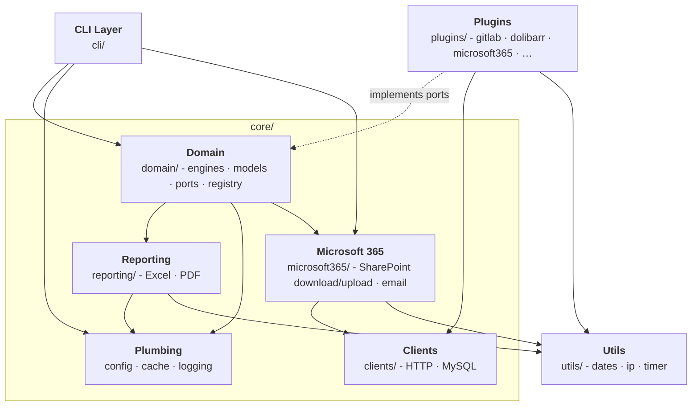
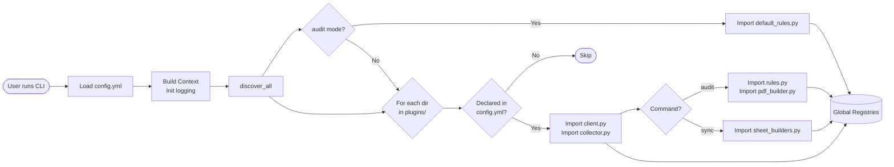
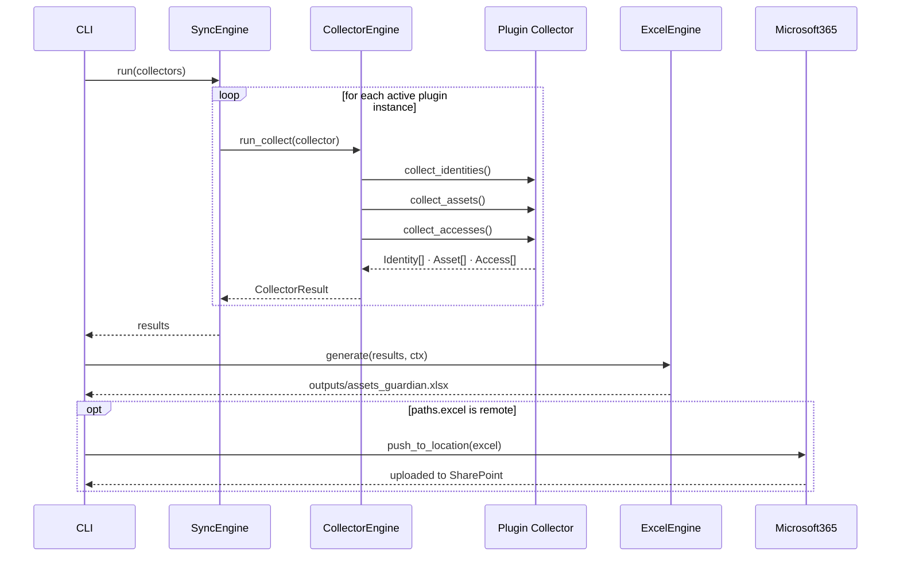
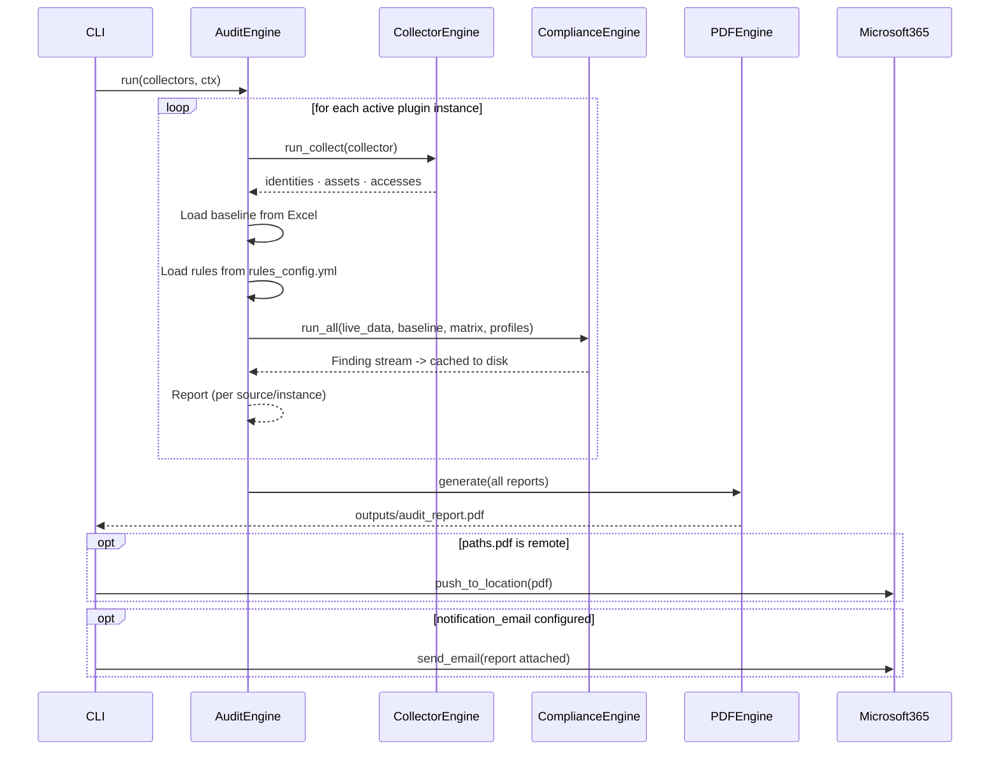
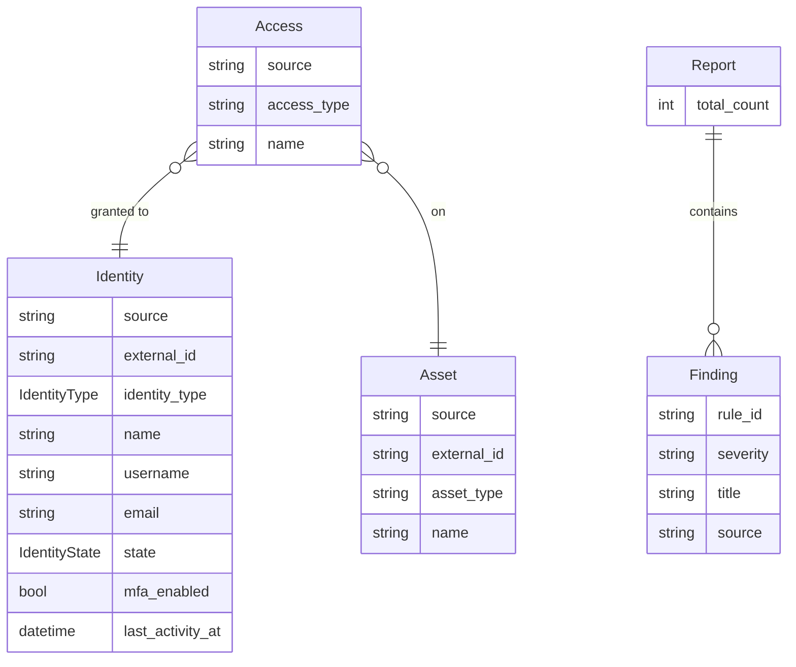
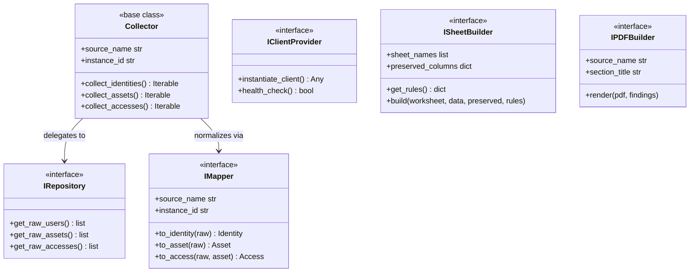

# 🏗️ Software Architecture Documentation

> ⚠️ **Warning:** This documentation is a work in progress. Some sections may be incomplete, inaccurate, or subject to change.

## What is Assets Guardian?

Assets Guardian is an **IAM (Identity and Access Management) governance tool**. Its job is to answer, at any time:

> *Who has access to what, with what role - and does that comply with the company's security policy?*

It connects to multiple external systems (GitLab, Microsoft 365, Dolibarr, Teleport, etc.), pulls access data from each, normalizes it into a unified model, and produces two artifacts:

- An **Excel workbook** - the living reference of all access rights across all systems, refreshed on every `sync`.
- A **PDF audit report** - a compliance report listing security gaps, violations, and anomalies.

Both artifacts can be written locally or pushed to a **SharePoint** document library (`remote:` paths, via the Microsoft 365 plugin), and the audit report can additionally be **emailed** to the recipients listed in `notification_email`.

The tool runs as a **non-interactive CLI**, designed for CI/CD pipelines, scheduled jobs, or manual runs by a security officer.

## System Overview

Assets Guardian is organized around a central `core/` package, a thin `cli/` entry point, shared `utils/`, and a separate `plugins/` boundary. Inside `core/`, each sub-package has a single responsibility and depends only on the packages below it.

> TODO: Make the diagram below easier to read, accurate but hard to follow (idea: add colors and arrows).



| Package | Responsibility |
| --- | --- |
| **CLI** (`cli/`) | Parses arguments, builds the execution `Context`, routes to the right command handler. |
| **Core** (`core/`) | The application heart. Groups the sub-packages below, everything that is not the `cli/` entry point, the shared `utils/`, or a `plugins/` adapter lives here. |
| → **Domain** (`core/domain/`) | Orchestrates business logic through engines. Defines abstract interfaces (ports) that plugins implement. |
| → **Reporting** (`core/reporting/`) | Adapters around the report artifacts: Excel sheet builders and PDF generation. |
| → **Clients** (`core/clients/`) | Low-level technical clients (HTTP, MySQL) used by plugin adapters to reach external systems. They implement no domain port, plugins wrap them behind `IClientProvider`. |
| → **Microsoft 365** (`core/microsoft365/`) | Resolves `remote:` (SharePoint) file locations for download/upload and sends notification emails, both via Microsoft Graph. Used by the CLI and by domain engines wherever a path can be remote. |
| → **Config · Cache · Logging** (`core/config/`, `core/cache/`, `core/logging/`) | Application plumbing only: configuration loading and validation, logger setup, file-based cache. |
| **Utils** (`utils/`) | Pure stateless helpers (dates, IP, timer) with zero project dependencies. |
| **Plugins** (`plugins/`) | Adapters for each external system. Plug into the domain via well-defined interfaces. The domain never imports from plugins. |

## Startup Sequence - Plugin Discovery

Before any command runs, the CLI bootstraps the application and dynamically discovers all active plugins. This is the mechanism that makes the system modular: plugins are loaded only if they appear in `config.yml`.



When a plugin module is imported, its components self-register into global registries via decorators (e.g. `@CollectorRegistry.register("gitlab")`). After discovery, engines retrieve what they need from these registries.

## Commands and Data Flows

### `sync` - Update the Excel repository

Fetches live data from all configured sources and writes it into the Excel workbook, preserving manually edited sheets.



**Key behaviours:**

- Manual tabs (e.g. the access matrix, employee mappings) are preserved - only auto-generated tabs are overwritten.
- If a collector fails, `SyncEngine` logs the error and continues with the remaining sources.
- If `paths.excel` contains the `DATE` placeholder, it is substituted with the current UTC date at write time, and `audit` recomputes the same name when reading the workbook back. When `paths.excel` is a `remote:` location, the workbook is uploaded to SharePoint after generation.
- Auto-generated sheets (everything except "... Matrix" sheets) are locked read-only within Excel's UI to deter accidental edits. This is a UI-level deterrent only (`openpyxl` sheet protection), not encryption - it is never verified by the tool itself and the password is not meant to be known by anyone.
- Every write stamps the workbook with a per-sheet SHA-256 checksum (stored in its custom document properties), computed on the file as actually saved to disk. The next `sync` recomputes it from the current file and logs a warning naming any sheet - including "... Matrix" ones, which stay editable but are still checked - that was modified outside Assets Guardian since the last write, together with the file's `lastModifiedBy`/`modified` core properties (self-reported by whatever application last saved it, so absent or generic for some non-Microsoft editors). See `ExcelWriter.__verify_integrity` / `__finalize_integrity_signature` in `core/reporting/excel/writer.py`.

### `audit` - Compliance audit and PDF report

Evaluates compliance rules against live data and the Excel baseline, then produces a PDF report.



**Key behaviours:**

- The **baseline** is the Excel workbook from the last `sync`. Comparison rules use it to detect changes (e.g. new accounts since last audit). It is resolved through `resolve_location_path`, so it can come from a local file or be downloaded from SharePoint.
- Findings are **streamed through a file cache** to avoid loading all data into memory at once.
- Each `(source_name, instance_id)` pair produces its own `Report`, then all reports are merged into a single PDF.
- Once generated, the report is uploaded to SharePoint if `paths.pdf` is a `remote:` location, and emailed to every address in `notification_email` (skipped with an info log if the list is empty).

### `check` - Configuration health check

Validates the whole environment before anything runs: configuration files, filesystem permissions, and connectivity to every configured plugin. Used for troubleshooting and CI/CD pre-flight validation.

`CheckEngine.run_details()` produces one pass/fail entry per check:

| Check | What it validates |
| --- | --- |
| `config` | `config.yml` parses and matches `template.config.yml` |
| `logging_path` · `logging_folder` | The logging location is local, and its directory exists and is writable |
| `employees` · `rules_config` | `employees.json` and `rules_config.yml` load (downloaded from SharePoint first if `remote:`) |
| `excel` · `pdf` | `excel_config.json` and `pdf_config.json` load, and are rejected if `remote:` |
| `output_paths` | `paths.excel` / `paths.pdf` parent directories are writable, or a microsoft365 integration exists when they are `remote:` |
| `cache_dir` | The cache directory exists and is readable/writable |
| `email` | `notification_email` is a list of syntactically valid addresses (empty list is a warning, not an error) |
| `instances` | Each configured `(source, instance)` client can be instantiated and passes its `health_check()` |

`rules_config` and `pdf` are only checked in `audit` and `check` modes, since `sync` does not read them.

> 💡 **Tip:** `check` never aborts, its job is to report. `sync` and `audit` however run the same engine first and refuse to start if any check fails.

### `script` - Power-user custom scripts

Runs an arbitrary Python file from the `scripts/` directory with the fully bootstrapped application context.

```bash
assets-guardian script my_automation   # runs scripts/my_automation.py
```

The script must expose a `run(ctx)` function. Because discovery has already happened by the time it is called, the script can reach every registry, client provider, and collector of the configured integrations through `ctx`.

> ⚠️ **Warning:** Scripts are executed without guardrails, unlike the rest of Assets Guardian. This command is intentionally an escape hatch for tinkerers.

## Domain Models

> TODO: To be reviewed.

These are the core data structures shared across all engines, plugins, and reporting adapters. `Identity`, `Asset`, `Access`, `Finding` and `Context` are **frozen dataclasses** - immutable once created, with field validation on construction. `Report` is the exception: it is a mutable container that accumulates findings and severity counters as the audit progresses.

In the diagram below, the fields listed first for `Identity`, `Asset` and `Access` (up to and including `name`) are the ones their constructor **requires**. This matters when reading an Excel workbook back into models, see [`excel_config.json`](PLUGIN.md#columns-required-by-the-round-trip).



| Model | Description |
| --- | --- |
| **Identity** | A person or service account retrieved from an external source. |
| **Asset** | A resource being protected (repository, project, application, server). |
| **Access** | A grant: an `Identity` holds a level of access (e.g. role, groupe) on an `Asset`. |
| **Location** | Representation and validation of a file path (local or remote) via a prefixed string (`local:` or `remote:`). |
| **Validator** | Helper utility used to validate model constraints during dataclass construction. |
| **Finding** | A compliance violation or anomaly detected by a rule. |
| **Report** | Aggregates all `Finding`s produced for one source/instance pair. |
| **Context** | Immutable execution context (config, flags, mode) passed through the entire call chain. |

## Plugin System

### What a plugin contains

A plugin is a directory under `plugins/` that adapts a specific external system to the domain interfaces. Each plugin can contain the following files:

| File | Required | Purpose |
| --- | --- | --- |
| `client.py` | Yes | Authenticates with the external system and creates the client object |
| `collector.py` | Yes | Implements `Collector` - orchestrates repositories and mappers |
| `repository.py` | Convention | Fetches raw data from the external resource. Imported by the plugin's own `collector.py`, never by the framework |
| `mapper.py` | Convention | Normalizes raw data responses into domain models (`Identity`, `Asset`, `Access`). Imported by the plugin's own `collector.py`, never by the framework |
| `rules.py` | No | Plugin-specific compliance rules evaluated during `audit`. Acts as the entry point that re-exports the rule classes defined in `compare.py`, `matrix.py` and `compliance.py` |
| `compare.py` | No | Comparison rules (`IComparisonRule`), live run vs the last Excel sync baseline |
| `matrix.py` | No | Matrix rules (`IMatrixRule`), active grants vs the expected access matrix |
| `compliance.py` | No | Compliance rules (`IComplianceRule`), criteria checked on live identities/assets |
| `sheet_builders.py` | No | Custom Excel sheet layouts injected during `sync` |
| `pdf_builder.py` | No | Custom PDF sections injected during `audit` report generation |
| `constants.py` | No | Source-specific constants (role names, access levels, etc.) |
| `excel_config.json` | No | Plugin-specific Excel column mapping and styling rules. Used during `sync` to write the sheets, and during `audit` to parse the previous workbook back into domain models, so a column must be mapped to every field the model's constructor requires |
| `CREDENTIALS.md` | No | Operator-facing guide: which credentials the plugin needs, how to generate them on the target platform, and the minimum permissions to grant |

Only `client.py`, `collector.py`, `rules.py`, `sheet_builders.py` and `pdf_builder.py` are filenames the discovery engine knows about and imports by name. Everything else is loaded by the plugin itself, so `repository.py`, `mapper.py`, `constants.py` and the `compare.py` / `matrix.py` / `compliance.py` split are conventions the codebase follows rather than framework requirements. See [PLUGIN.md](PLUGIN.md) for the full authoring guide.

### Plugin interfaces

> TODO: Probably needs revisiting depending on the changes made after the review.

The domain defines six abstract interfaces in `core/domain/ports/`. The first four are the collection pipeline every plugin fulfills, the last two are optional reporting hooks:



`Collector` is a base class with default implementations that delegate to `_repository` and `_mapper`. Plugin collectors override only the methods where they need non-standard behaviour.

`ISheetBuilder` (implemented in `sheet_builders.py`) and `IPDFBuilder` (implemented in `pdf_builder.py`) are optional: a plugin that ships neither still syncs and audits normally, it simply gets the generic Excel sheet driven by its `excel_config.json` and no dedicated PDF section.

### Registration via decorators

Components self-register into global registries when their module is imported. This happens automatically during the discovery phase - no manual wiring needed.

```python
# plugins/gitlab/collector.py
@CollectorRegistry.register("gitlab")
class GitlabCollector(Collector):
    ...

# plugins/gitlab/compare.py - source is inferred from the module path
@RuleRegistry.register("COMPARE-001")
class GitlabNewUserComparisonRule(IComparisonRule):
    ...

# plugins/default_rules.py - registered under source "default", available to all plugins
@RuleRegistry.register("DEFAULT-001")
class MultiFactorAuthRule(IComplianceRule):
    ...
```

One thing to note:

- **Rules inherit from a specific sub-interface**, not `IRule` directly, depending on their category:

  | Interface | Category | Purpose | Example |
  | --- | --- | --- | --- |
  | `IComplianceRule` | **Compliance** | Standard rule checking specific criteria on live identities or assets. | `DEFAULT-001` (MFA disabled) |
  | `IComparisonRule` | **Comparison** | State check comparing current live run against the last Excel sync baseline. | `COMPARE-001` (GitLab user added) |
  | `IMatrixRule` | **Matrix** | Comparing active access grants with the expected access defined in the access matrix tab. | `MATRIX-001` (Dolibarr admin compliance) |

The registries are global singletons. After discovery, the factory function `instantiate_collectors(integrations_config)` (in `core/domain/registry/collector_factory.py`) returns a ready-to-use collector instance for every configured `(source, instance)` pair, e.g. a `GitlabCollector`, without the engines ever knowing the concrete classes.

### Multi-instance support

A single plugin (e.g. `gitlab`) can be configured for multiple independent instances (e.g. `gitlab.company.com` and `gitlab.subsidiary.com`). The `instance_id` property on `Collector` ensures each instance's data remains separate throughout the pipeline, and produces its own `Report`.

```yaml
# config/config.yml
gitlab:
  gitlab.company.com:  # instance 1
    url: https://gitlab.company.com/api/v4
  gitlab.subsidiary.com:  # instance 2
    url: https://gitlab.subsidiary.com/api/v4
```

Plugin sections sit at the **root** of `config.yml`, there is no `integrations:` wrapper key: any top-level key that is not one of the core keys (`env`, `version`, `author`, `notification_email`, `logging`, `paths`, `cache`) is treated as an integration and must match a directory in `plugins/`.

## Design Patterns

### Hexagonal Architecture (Ports and Adapters)

The domain layer defines **ports** (abstract interfaces in `core/domain/ports/`) and contains all business logic. Plugins implement **adapters** that fulfill these ports. The domain has zero knowledge of GitLab, REST APIs, or SQL.

```text
External systems (APIs, databases)
        ↕
  Adapters (plugins)
        ↕
  Ports (abstract interfaces)   ← boundary
        ↕
  Domain (engines + models)
```

Adding a new source or replacing an existing one never touches the core engines - only a new plugin directory is needed.

### Registry and Factory

Plugins register their classes into global registries at import time. At runtime, engines ask factories to instantiate collectors and rules by source name. The engine never imports or names a plugin class directly.

This is what allows the system to be configuration-driven: if `gitlab` is in `config.yml`, the GitLab plugin is loaded and used; if it is removed, it is ignored with no code change.

> TODO: Adding a Mermaid diagram could be interesting? Maybe a quick job for Claude?

### Template Method (Collector base class)

`Collector` provides default implementations of `collect_identities`, `collect_assets`, and `collect_accesses`. These iterate over raw results from `_repository` and normalize them via `_mapper`. A plugin collector only needs to override the methods where it requires custom behaviour (e.g. joining data from multiple API calls).

> TODO: Adding a Mermaid diagram could be interesting? Maybe a quick job for Claude?

### Strategy (Compliance rules)

Each compliance rule is an independent strategy object implementing `IRule.evaluate(...)`. The `ComplianceEngine` runs all active rules without knowing their internal logic. Rules are composable, independently testable, and can be enabled or disabled per source in `rules_config.yml`.

> TODO: Adding a Mermaid diagram could be interesting? Maybe a quick job for Claude? It could simply be an excerpt from the `rules_config.yml` file.

### Dependency Injection

Engines receive their dependencies (cache, collector engine) via constructor parameters. Plugin collectors receive their client and config at construction time. This simplifies unit testing: pass mock or stub objects into constructors without patching globals.

> TODO: A code example?

### Cache (JSON Lines)

To scale efficiently and support high-volume data retrieval without RAM spikes, the caching layer (`core/cache`) implements a **JSONL (JSON Lines) Cache Manager**:

- **Disk Streaming & Chunking**: Using `LazyCacheIterable` and `itertools.batched`, the system writes and reads collected domain objects incrementally in configurable batches. This avoids storing all raw objects in memory at once.
- **Atomic Disk Writes**: Files are written first as `.tmp` drafts and swapped atomically via `os.replace` to prevent data corruption during unexpected CLI interruptions.
- **Environment-Aware Retention**: At the end of each command, the cache directory is emptied when `env` is `prod`, but kept in `dev` and `test` to prevent redundant external API hits. The cleanup removes **every file** in the directory, not just the JSONL batches: files pulled from SharePoint and date-stamped artifacts staged before upload are cleared too. Sub-directories are left untouched.

> TODO: Adding a Mermaid diagram could be interesting? Maybe a quick job for Claude?

## Configuration Reference

### `config/config.yml` - Main configuration

The central hub. Controls which plugins are active, logging behavior, and file paths.

> TODO: A description of each config.py parameter is needed: the possible values and their purpose across Assets Guardian.

```yaml
env: "dev" # or prod

author:
  fullname: "First name LAST NAME"
  email: "...@example.com"

notification_email:
  - "...@example.com"
  - "...@example.com"

logging:
  console_level: "info"
  file_level: "debug"
  file-basename: "assets-guardian"
  max-size: 10 # MB
  max-files: 3
  path: "local:logs"

paths:
  excel: "local:outputs/assets_guardian.xlsx"
  pdf: "local:outputs/audit_report.pdf"
  rules: "local:config/rules_config.yml"
  excel_config: "local:config/excel_config.json"
  pdf_config: "local:config/pdf_config.json"
  employees: "local:config/employees.json"

cache:
  batch_size: 64
  cache_dir: ".assets-guardian_cache"

mon_plugin:
  prod:
    url: "https://mon_plugin_prod.company.com/"
    credentials:
      token: "${MON_PLUGIN_PROD_TOKEN}" # resolved from environment variable
  test:
    url: "postgresql://db_mon_plugin.company.com:5432/assets"
    credentials:
      username: "${MON_PLUGIN_PROD_USERNAME}" # resolved from environment variable
      password: "${MON_PLUGIN_PROD_PASSWORD}" # resolved from environment variable
```

Only plugins listed are discovered and loaded. Removing a plugin key (e.g. `gitlab`) disables the plugin entirely. For a complete reference, see `template.config.yml`.

### `config/rules_config.yml` - Compliance rules

Specifies which rules are active for each source, and their parameters.

> TODO: A description of the configuration options for each rule is needed...

```yaml
gitlab:
  # Load all default rules defined in plugins/default_rules.py
  # (DEFAULT-XXX and the CTRL_HUMAN_*/CTRL_SERVICE_*/CTRL_GENERIC_* identity
  # naming-convention rules)
  <<: *default_rules

  # Configure plugin-specific rules with their appropriate parameters and severity
  COMPARE-001:
    name: "New GitLab users"
    severity: INFO

  COMPLIANCE-001:
    description: "Gitlab mailbox not listed in employees.json."
    severity: "WARNING"
    employees_file_path: "config/employees.json"   # Free-form parameter, read by the rule itself

  MATRIX-001:
    description: "GitLab instance administrator access not authorized by the matrix."
    severity: "DANGER"

dolibarr:
  <<: *default_rules

  COMPLIANCE-001:
    description: "Dolibarr mailbox not listed in employees.json."
    severity: "WARNING"

  DOLIBARR-005:
    description: "Lists disabled user accounts in Dolibarr."
    severity: "INFO"
```

Rule IDs match the `@RuleRegistry.register(rule_id)` decorator, declared in the plugin's `compare.py`, `matrix.py` or `compliance.py` and re-exported through its `rules.py`, or in `plugins/default_rules.py` for the shared rules. They are namespaced per source, so `gitlab`'s `COMPLIANCE-001` and `dolibarr`'s `COMPLIANCE-001` above are two independent rules. See [Registration via decorators](#registration-via-decorators) and [Naming rule IDs](PLUGIN.md#naming-rule-ids) for the rule categories (`COMPARE-XXX`, `COMPLIANCE-XXX`, `MATRIX-XXX`, `DEFAULT-XXX` and `CTRL_*`), and for the plugin-prefixed form (`DOLIBARR-005`) that a few source-specific rules use.

[`config/template.rules_config.yml`](https://github.com/apizee/assets-guardian/blob/main/config/template.rules_config.yml) is the exhaustive reference: it lists every rule available for every shipped plugin.

### `config/employees.json` - HR reference

The source of truth for known identities. Used during `audit` to detect **shadow accounts**, identities found in an external system that have no corresponding HR record.

Each entry maps a real person to their known identifier in the information system like email address. The `profiles` field lists the security profiles assigned to that employee, used by matrix rules to validate their access rights.

Example of `employees.json` :

```json
[
    {
        "first_name": "John",
        "last_name": "Doe",
        "email": ["john.doe@company.com", "jdoe@company.com"],
        "username": ["jdoe", "john.doe"],
        "profiles": "Marketing, Finance"
    },
    {
        "first_name": "Ada",
        "last_name": "Lovelace",
        "email": ["ada.lovelace@company.com"],
        "username": ["alovelace"],
        "profiles": "R&D, Support"
    }
]
```

## Key Technical Decisions

> TODO: Probably incomplete... Isn't this redundant with the rest of the document? It looks like a rationale for each technical dependency choice, but it drifts into software architecture choices such as the cache, or even Docker...

| Decision | Choice | Rationale |
| --- | --- | --- |
| **Language** | Python 3.13 | Rich ecosystem for Excel/PDF; strict typing available |
| **CLI framework** | Click | Clean group/subcommand model with context passing |
| **Excel** | openpyxl | Full read/write with formatting and sheet preservation |
| **PDF** | fpdf2 | Lightweight; no Java dependency unlike reportlab alternatives |
| **Microsoft 365** | msgraph-sdk + azure-identity | Official Graph SDK and credential flow; covers identities, SharePoint files and mail in one client |
| **Package manager** | uv + hatchling | Fast, reproducible installs; replaces pip + setuptools |
| **Linting** | Ruff | Replaces flake8 + black + isort in a single fast tool |
| **Type checking** | Mypy (strict mode) | Catches interface mismatches between plugins and ports at dev time |
| **Models** | Frozen dataclasses | Immutability prevents accidental mutation in engines; slot optimization |
| **Cache & Persistence** | JSON Lines (JSONL) | Streaming data-offloading to disk using batched generators to keep RAM footprint low; crash checkpoint capabilities |
| **Containerization** | Multi-stage Docker | Minimal production image; non-root user for security |
