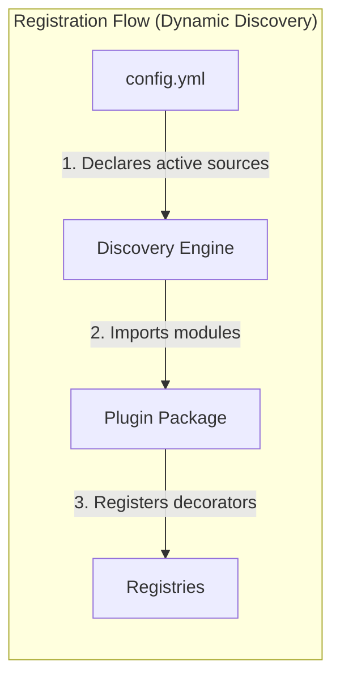
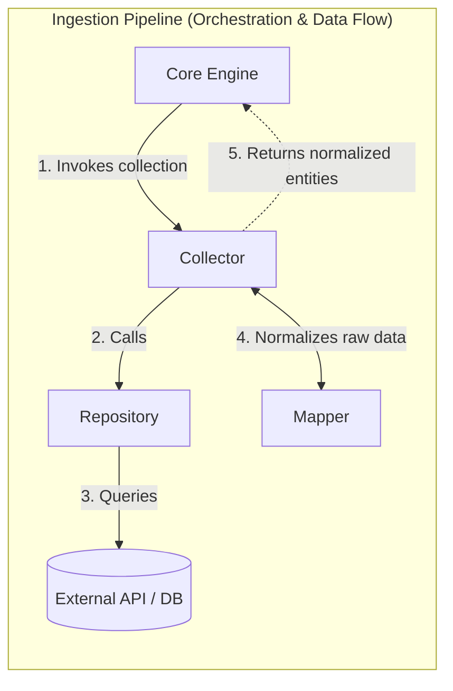
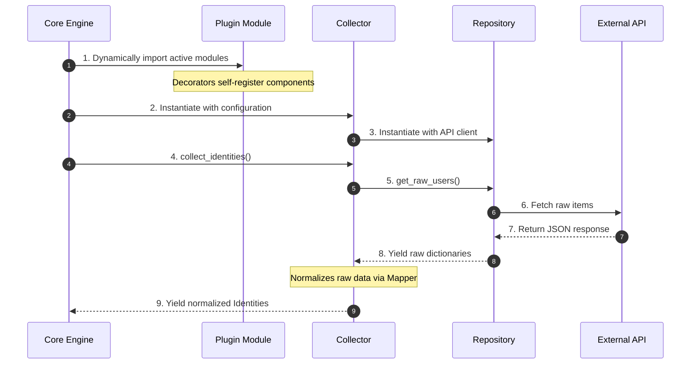

# 🧩 Plugin Development Guide

> ⚠️ **Warning:** This documentation is a work in progress. Some sections may be incomplete, inaccurate, or subject to change.

This guide explains how to develop a plugin for **Assets Guardian**. Each plugin integrates an external Identity and Access Management (IAM) source (GitLab, Microsoft 365, Dolibarr, etc.) into the framework without modifying the core codebase.

## Architecture Overview

Assets Guardian uses a **registry-based plugin architecture**. Plugins are discovered dynamically at runtime based on the application configuration. The framework scans the `plugins/` directory, imports configured plugin modules, and collects components registered via decorators.





### Key Design Principles

- **Configuration-driven loading**: A plugin is imported and loaded **only** if its source name appears in `config.yml`. Unconfigured plugins remain inert.
- **Mode-aware discovery**: Components are selectively loaded based on execution mode:
    - **SYNC mode**: Loads core interfaces + `ISheetBuilder`.
    - **AUDIT mode**: Loads core interfaces + `IRule` & `IPDFBuilder`.
- **Decorator registration**: Components self-register via class decorators (e.g. `@CollectorRegistry.register("myplugin")`).
- **Multi-instance support**: The framework supports configuring multiple named instances for the same plugin (e.g., `prod`, `staging`), each with independent configs.

## Plugin Directory Structure

A standard plugin resides in `src/assets_guardian/plugins/` and follows this layout:

```text
plugins/
└── myplugin/
    ├── __init__.py          # Marks the directory as a Python package
    ├── constants.py         # SOURCE_NAME, role mappings, and other constants
    ├── client.py            # IClientProvider - creates the connection client
    ├── repository.py        # IRepository - fetches raw data from the external source
    ├── mapper.py            # IMapper - normalizes raw data to domain models
    ├── collector.py         # Collector - orchestrates repository and mapper
    ├── rules.py             # Optional - entry point re-exporting the rule classes below
    ├── compliance.py        # Optional - IComplianceRule implementations
    ├── compare.py           # Optional - IComparisonRule implementations
    ├── matrix.py            # Optional - IMatrixRule implementations
    ├── excel_config.json    # Optional - declarative Excel sheets (GenericSheetBuilder)
    ├── sheet_builders.py    # Optional - ISheetBuilder implementation (sync mode only)
    ├── pdf_builder.py       # Optional - IPDFBuilder implementation (audit mode only)
    └── CREDENTIALS.md       # Optional - operator guide: credentials and required permissions
```

The discovery engine only ever imports **`client.py` and `collector.py`**, plus `rules.py`, `sheet_builders.py` and `pdf_builder.py` depending on the execution mode. Those are the only filenames the framework knows about, so they must be named exactly like this.

`constants.py`, `repository.py` and `mapper.py` are a strong convention rather than a framework requirement: nothing loads them directly, your `collector.py` imports them itself. Splitting the rules across `compliance.py` / `compare.py` / `matrix.py` is the same kind of convention, only `rules.py` is imported, and it re-exports the classes defined in those files.

> 💡 **Tip:** `plugins/_template/` is a working skeleton containing all of the above. Copy it as your starting point rather than creating files one by one.

## Core Interfaces (Required)

### `IClientProvider`

**File:** `core/domain/ports/client.py`
**Purpose:** Establish and health-check the connection client for the external source.

```python
class IClientProvider(ABC):
    """Port: Client provider used to collect data.

    Defines the contract for obtaining a client
    specific to a data source.
    """

    def __init__(self, config: dict[str, Any]) -> None:
        """Initialize the client provider with the instance's configuration dictionary."""
        raise NotImplementedError

    @abstractmethod
    def instantiate_client(self) -> HttpClient | MySQLClient | Any:
        """Returns a ready-to-use client.

        The return type depends on the specific implementation (e.g., GraphServiceClient,
        requests Session, GitLab client, etc.).
        """
        raise NotImplementedError

    @abstractmethod
    def health_check(self) -> bool:
        """Verifies that the client connection, return True if the remote service is reachable and credentials are valid, else False."""  # noqa: E501
        raise NotImplementedError
```

> `health_check` must never raise exceptions. Always catch connection errors, log them, and return `False`.

`core/clients/` ships three reusable low-level clients. Wrap one of them, or return any client object your source needs, the framework never inspects the type:

| Client | File | Use for |
| :--- | :--- | :--- |
| `HttpClient` | `core/clients/http_client.py` | REST APIs over HTTP, with header-based authentication |
| `MySQLClient` | `core/clients/mysql_client.py` | Sources read straight from a MySQL database |
| `MicrosoftGraph` | `core/clients/microsoft_client.py` | Microsoft Graph, wrapping `GraphServiceClient` and the Azure credential flow. Takes `tenant_id`, `client_id`, `client_secret` and `graph_scopes` |

> 💡 **Tip:** `MicrosoftGraph` is not only used by the Microsoft 365 plugin: `core/microsoft365/` relies on it to resolve `remote:` SharePoint paths and to send the audit report by email, for any plugin.

**Example:**

```python
@ClientProviderRegistry.register("myplugin")
class MyPluginClientProvider(IClientProvider):
    def __init__(self, config: dict[str, Any]) -> None:
        self.__config = config

    def instantiate_client(self) -> HttpClient:
        token = self.__config["credentials"]["api_token"]
        return HttpClient(
            base_url=self.__config["url"],
            headers={"Authorization": f"Bearer {token}"},
        )

    def health_check(self) -> bool:
        try:
            client = self.instantiate_client()
            return client.get("/health").status_code == 200
        except Exception as e:
            logger.error(f"Health check failed for myplugin: {e}")
            return False
```

### `IRepository`

**File:** `core/domain/ports/repository.py`
**Purpose:** Retrieve raw JSON/dict payloads from the external system.

```python
class IRepository(ABC):
    """Port: Raw data repository access.

    Defines the contract for retrieving raw data
    from an external source (API, database, etc.).
    """

    @abstractmethod
    def get_raw_users(self) -> Iterable[dict[str, Any]]:
        """Retrieves the raw list of users."""
        raise NotImplementedError

    @abstractmethod
    def get_raw_assets(self) -> Iterable[dict[str, Any]]:
        """Retrieves the raw list of assets (projects, sites, etc.)."""
        raise NotImplementedError

    @abstractmethod
    def get_raw_accesses(self) -> Iterable[dict[str, Any]]:
        """Retrieves the raw list of accesses/permissions."""
        raise NotImplementedError
```

> Return `Iterable` (generators or lazy iterables) to optimize memory footprint when fetching large quantities of records.

**Example:** see [`plugins/myplugin/repository.py`](#pluginsmypluginrepositorypy) in the complete example below.

### `IMapper`

**File:** `core/domain/ports/mapper.py`
**Purpose:** Pure data normalization. Converts raw, source-specific payloads into clean, strongly typed Assets Guardian domain models (`Identity`, `Asset`, `Access`).

```python
class IMapper(ABC):
    """Port: Data normalizer (mapper).

    Defines the contract for converting raw data from APIs
    to the domain's normalized data models.
    """

    @property
    @abstractmethod
    def source_name(self) -> str:
        """Unique source name (must match config.yml)."""
        raise NotImplementedError

    @property
    @abstractmethod
    def instance_id(self) -> str:
        """The specific instance identifier (e.g., 'main', 'prod')."""
        raise NotImplementedError

    @abstractmethod
    def to_identity(self, raw_data: Any) -> Identity:
        """Converts raw data to an Identity object."""
        raise NotImplementedError

    @abstractmethod
    def to_asset(self, raw_data: Any) -> Asset:
        """Converts raw data to an Asset object."""
        raise NotImplementedError

    @abstractmethod
    def to_access(self, raw_data: Any, asset: Asset | None = None) -> Access:
        """Converts raw data to an Access object."""
        raise NotImplementedError
```

**Example:** see [`plugins/myplugin/mapper.py`](#pluginsmypluginmapperpy) in the complete example below.


### `Collector`

**File:** `core/domain/ports/collector.py`
**Purpose:** Orchestrates the ingestion pipeline. It coordinates the repository (data retrieval) and mapper (data translation).

```python
class Collector:
    def __init__(self, client: Any, instance_config: dict[str, Any]) -> None:
        self._client = client
        self._config = instance_config
        self._repository: IRepository
        self._mapper: IMapper

    @property
    def source_name(self) -> str: ...

    @property
    def instance_id(self) -> str: ...

    def collect_identities(self) -> Iterable[Identity]: ...
    def collect_assets(self) -> Iterable[Asset]: ...
    def collect_accesses(self) -> Iterable[Access]: ...
    def collect_groups(self) -> Iterable[Any]: ...
    def collect_permissions(self) -> Iterable[Any]: ...
```

> The base `Collector` class provides default loop implementations that fetch raw items from the repository and map them. You only need to override `collect_*` methods if you require custom filtering, secondary API requests, or advanced orchestration.

**Example:** see [`plugins/myplugin/collector.py`](#pluginsmyplugincollectorpy) in the complete example below.

## Optional Interfaces

### `ISheetBuilder` (Sync Mode)

**File:** `core/domain/ports/sheet_builders.py`
**Purpose:** Dictates how sync data is printed to the output Excel reference sheet and which manual columns should be protected during regenerations.

```python
class ISheetBuilder(ABC):
    """Port: Excel sheet builder (Plugin).

    Contract for plugins wishing to add specific sheets
    to the Excel referential.
    """

    # Injected by the registry upon registration
    source_name: str = ""

    @property
    @abstractmethod
    def sheet_names(self) -> list[str]:
        """List of Excel sheet names managed by this builder."""
        raise NotImplementedError

    @property
    @abstractmethod
    def preserved_columns(self) -> dict[str, dict[str, list[str]]]:
        """Defines the columns to preserve per sheet.

        Example::

            {
                'Sheet1': {'primary_keys': ['ID'], 'columns': ['Comments']},
                'Sheet2': {'primary_keys': ['UUID'], 'columns': ['Account Type']}
            }
        """
        raise NotImplementedError

    @abstractmethod
    def get_rules(self) -> dict[str, Any]:
        """Returns plugin-specific Excel formatting rules."""
        raise NotImplementedError

    @abstractmethod
    def build(
        self,
        worksheet: Any,
        data: Any,
        preserved: Any,
        rules: Any,
    ) -> None:
        """Builds the Excel sheet for this plugin.

        Args:
            worksheet: The Excel sheet (ExcelWorksheet).
            data: Dictionary of collection results (source, instance) -> CollectorResult.
            preserved: Manual data extracted from the existing sheet for preservation.
            rules: Formatting and validation rules.
        """
        raise NotImplementedError
```

> ⚠️ **Warning:** `source_name` is declared on the interface, but the Excel writer also reads an **`instance_id`** attribute on your builder to name sheets per instance (`Myplugin (prod) Users`). It is looked up with `getattr`, so a builder that does not expose it does not crash: it silently falls back to the generic sheet name, and two instances of the same plugin then collide on the same sheet. Expose both when your plugin is multi-instance.
>
> 💡 **Tip:** Every sheet your builder returns is automatically read-only locked in Excel and checksummed for tamper detection by `ExcelWriter` (unless its name ends in `" Matrix"`) — there is nothing to opt into or configure on your side. See `ExcelWriter.__protect_sheet` / `__finalize_integrity_signature` in `core/reporting/excel/writer.py`.

**Example:**

> TODO: Complete with an example...

```python
```

### `IRule` (Audit Mode)

**File:** `core/domain/models/rules/rule.py`
**Purpose:** Inspects normalized domain collections to find anomalies or non-compliance states, producing `Finding` objects.

```python
class IRule(ABC):
    """Base interface for all audit rules."""

    rule_id: str = ""

    @property
    @abstractmethod
    def rule_category(self) -> RuleCategory:
        """Category of the rule."""
        raise NotImplementedError

    @property
    @abstractmethod
    def severity(self) -> SeverityType:
        """Severity level of the rule."""
        raise NotImplementedError

    @property
    @abstractmethod
    def target_entity(self) -> str:
        """Entity targeted by the rule."""
        raise NotImplementedError

    @property
    @abstractmethod
    def name(self) -> str:
        """Name of the rule."""
        raise NotImplementedError

    @property
    @abstractmethod
    def description(self) -> str:
        """Description of the rule."""
        raise NotImplementedError

    @abstractmethod
    def evaluate(self, **kwargs: Any) -> Iterable[Finding]:
        """Evaluates the rule on the provided data."""
        raise NotImplementedError
```

**Never inherit from `IRule` directly.** Pick the sub-interface matching what the rule compares, it determines which arguments the engine passes to `evaluate()`:

| Sub-interface | File | Category | `evaluate()` receives | Use it for |
| --- | --- | --- | --- | --- |
| `IComplianceRule` | `models/rules/compliance.py` | `COMPLIANCE` | `entries`, `config` | A criterion checked on live identities or assets (MFA disabled, inactive account) |
| `IComparisonRule` | `models/rules/comparison.py` | `COMPARISON` | `old_data`, `new_data` | A change since the last `sync`, using the Excel workbook as baseline (user added, MFA revoked) |
| `IMatrixRule` | `models/rules/matrix.py` | `MATRIX` | `accesses`, `matrix`, `profiles` | Active grants versus the authorized access matrix (see [ACCESS_MATRIX.md](ACCESS_MATRIX.md)) |

**Reading `severity` from the configuration.** `severity` is a property of your class, but its value must come from `rules_config.yml`, never be hardcoded. Read it in `__init__` from `kwargs`, and when it is absent **log a warning and fall back to a default** rather than raising: an unconfigured severity must not abort the audit.

```python
@RuleRegistry.register("COMPLIANCE-001")
class MyPluginInactiveAccountRule(IComplianceRule):
    rule_id: str = "COMPLIANCE-001"

    def __init__(self, **kwargs: Any) -> None:
        self._name = kwargs.get("name", "Inactive account")
        self._description = kwargs.get("description", "The account is disabled on the source.")

        severity_value = kwargs.get("severity")
        if not severity_value:
            logger.warning(
                "Rule %s: no 'severity' configured in rules_config.yml, defaulting to %s.",
                self.rule_id,
                SeverityType.WARNING,
            )
            severity_value = SeverityType.WARNING
        self._severity = SeverityType(severity_value)

    @property
    def severity(self) -> SeverityType:
        return self._severity
```

> ⚠️ **Warning:** Test `if not severity_value` explicitly, do **not** rely on `kwargs.get("severity", DEFAULT)`. The default of `.get()` only applies when the key is **missing**: a key present but left empty in the YAML (`severity:` with no value) yields `None`, and `SeverityType(None)` raises a `ValueError` that aborts the whole audit.
>
> 💡 **Tip:** Every field of a rule entry in `rules_config.yml` reaches `__init__` through `kwargs`, so custom parameters (thresholds, IP ranges, flags) are read exactly the same way. Apply the same warning-and-fallback treatment to them.
>
> 💡 **Tip:** If your plugin registers several rules, extract the warning-and-fallback logic into a small module-level helper (e.g. `_resolve_severity(rule_id, raw_severity, default)`) instead of duplicating it in every `__init__`. See `plugins/default_rules.py` for a concrete example shared by the `CTRL_HUMAN_*`/`CTRL_SERVICE_*`/`CTRL_GENERIC_*` rules.

**Example:**

The `CTRL_HUMAN_*` rules in `plugins/default_rules.py` verify that identity fields (last name, first name, username, email, ...) follow the company's identity-naming convention. Each rule inspects a single, narrow criterion on `entries` filtered by `identity.identity_type`, and only emits a `Finding` when the field is present but incorrectly formatted — a rule never flags a field that the source simply does not provide (e.g. GitLab has no separate `first_name`/`last_name`, only a merged `name`), it silently skips those identities instead of guessing:

```python
@RuleRegistry.register("CTRL_HUMAN_LAST_NAME")
class HumanLastNameFormatRule(IComplianceRule):
    rule_id: str = "CTRL_HUMAN_LAST_NAME"

    def __init__(self, **kwargs: Any) -> None:
        self.__name = kwargs.get("name", "Last name not uppercase")
        self.__description = kwargs.get(
            "description",
            "Last name must be entered entirely in uppercase, while preserving "
            "accents and special characters (e.g. hyphens).",
        )
        self.__severity = _resolve_severity(
            self.rule_id, kwargs.get("severity"), SeverityType.WARNING
        )

    @property
    def severity(self) -> SeverityType:
        return self.__severity

    def evaluate(self, entries: Iterable[Identity], config: dict[Any, Any] | None = None):
        for identity in entries:
            if identity.identity_type != IdentityType.HUMAN:
                continue
            if identity.last_name and identity.last_name != identity.last_name.upper():
                yield Finding(...)
```

### `IPDFBuilder` (Audit Mode)

**File:** `core/domain/ports/pdf_builders.py`
**Purpose:** Appends custom styled chapters summarizing plugin-specific findings inside the compiled PDF report.

```python
class IPDFBuilder(ABC):
    """Contract that each plugin implements to render
    its section in the PDF audit report.
    """

    @property
    @abstractmethod
    def source_name(self) -> str:
        """Name of the source ('gitlab', 'm365', 'dolibarr')."""
        raise NotImplementedError

    @property
    @abstractmethod
    def section_title(self) -> str:
        """Title of the section in the PDF report.
        E.g., 'GitLab - gitlab.com'
        """
        raise NotImplementedError

    @abstractmethod
    def render(self, pdf: Any, findings: Iterable[Finding]) -> None:
        """Renders the PDF section for this source.

        Args:
            pdf: The PDF object currently being built (FPDF or equivalent).
            findings: List of Finding elements filtered for this source,
                      already grouped by severity by the calling PDFWriter.
        """
        raise NotImplementedError
```

**Example:**

> TODO: Complete with an example...

```python
```

## Registries & Registration

Decoupled components register themselves dynamically using Python decorators.

| Component | Target Registry | Decorator | Required |
| --- | --- | --- | :---: |
| `IClientProvider` | `ClientProviderRegistry` | `@ClientProviderRegistry.register("myplugin")` | ✅ |
| `Collector` | `CollectorRegistry` | `@CollectorRegistry.register("myplugin")` | ✅ |
| `IRule` | `RuleRegistry` | `@RuleRegistry.register("COMPLIANCE-001")` | ⚠️ |
| `ISheetBuilder` | `SheetBuilderRegistry` | `@SheetBuilderRegistry.register("myplugin")` | ❌ |
| `IPDFBuilder` | `PDFBuilderRegistry` | `@PDFBuilderRegistry.register("myplugin")` | ❌ |

The two first are **mandatory**: without them the plugin cannot authenticate nor collect anything, and it is effectively absent from every command.

`IRule` is **partially optional**. A plugin with no rule of its own still collects and syncs normally, and still benefits from the built-in `DEFAULT-XXX` and `CTRL_*` rules of `plugins/default_rules.py`, which any source can inherit by pulling the `<<: *default_rules` anchor into its `rules_config.yml` section. It simply contributes no source-specific finding to the audit.

`ISheetBuilder` and `IPDFBuilder` are **fully optional**, because the framework provides a fallback for each. Without a sheet builder, the `GenericSheetBuilder` renders your sheets from `excel_config.json`, which is the recommended path. Without a PDF builder, findings are still rendered in the report using the default layout, only without a section styled specifically for your source.

> Do not register `IRepository` or `IMapper`. They are instantiated internally within the plugin's `Collector`.

### Naming rule IDs

`RuleRegistry.register()` accepts any string, and namespaces it under the source it infers from the module path, so `gitlab`'s `MATRIX-001` and `dolibarr`'s `MATRIX-001` are two independent rules that never collide. The recommended convention is therefore to name rules **by category, not by plugin**:

| Prefix | Category | Interface |
| :--- | :--- | :--- |
| `COMPLIANCE-XXX` | Criterion checked on live data | `IComplianceRule` |
| `COMPARE-XXX` | Change since the last `sync` | `IComparisonRule` |
| `MATRIX-XXX` | Grants versus the access matrix | `IMatrixRule` |
| `DEFAULT-XXX` | *Reserved* for the built-in rules of `plugins/default_rules.py` | `IComplianceRule` |
| `CTRL_HUMAN_*` / `CTRL_SERVICE_*` / `CTRL_GENERIC_*` | *Reserved* for the built-in identity naming-convention rules of `plugins/default_rules.py` | `IComplianceRule` |

Numbering restarts at `001` per category and per plugin. A plugin-prefixed form (`MYPLUGIN-001`) also works and appears in a few places in the codebase, but it carries no information about the rule's category, which is what actually determines the arguments `evaluate()` receives.

> ⚠️ **Warning:** Never register a rule of your own under a `DEFAULT-XXX` or `CTRL_*` ID. Those IDs belong to the built-in rules shared by every source, and reusing one under your plugin's namespace makes `rules_config.yml` ambiguous to read.
>
> 💡 **Exception to the numbering convention:** unlike every other prefix, `CTRL_<TYPE>_<FIELD>` does not end in a numeric suffix. Each ID instead mirrors, field for field, the identity-creation naming-convention procedure it enforces (e.g. `CTRL_HUMAN_LAST_NAME` checks the "last name" attribute for human identities), so the rule ID stays traceable back to that source document rather than to an arbitrary sequence number.

## JSON Excel Configuration (Generic Sheet Builder)

Instead of writing a custom `ISheetBuilder` from scratch in Python, it is highly recommended to leverage the framework's metadata-driven **`GenericSheetBuilder`**. This lets you declare sheet names, columns, value mappings, validations, and conditional styles using a simple JSON file (traditionally named `excel_config.json` inside your plugin directory).

### JSON Configuration Structure

A plugin's Excel configuration is structured as a dictionary of sheet configurations. Here is a complete structure illustrating all possible properties, mappings, list validations, and conditional formats:

```json
{
  "MyPlugin - Users": {
    "data_source": "identities",
    "columns": [
      {
        "column_name": "User ID",
        "field": "external_id",
        "is_primary_key": true,
        "width": 12
      },
      {
        "column_name": "Full Name",
        "field": "name",
        "width": 25
      },
      {
        "column_name": "Account Type",
        "is_preserved": true,
        "width": 15
      },
      {
        "column_name": "2FA",
        "field": "mfa_enabled",
        "width": 12,
        "mapping": {
          "Enabled": true,
          "Disabled": false
        },
        "rules": [
          {
            "rule_type": "list_validation",
            "validate": "list",
            "source": ["Enabled", "Disabled"]
          },
          {
            "rule_type": "conditional_format",
            "criteria": "==",
            "value": "Disabled",
            "format": "red"
          }
        ]
      },
      {
        "column_name": "Administrator",
        "field": "is_privileged",
        "width": 15,
        "mapping": {
          "True": true,
          "False": false
        },
        "rules": [
          {
            "rule_type": "list_validation",
            "validate": "list",
            "source": ["True", "False"]
          },
          {
            "rule_type": "conditional_format",
            "criteria": "==",
            "value": "True",
            "format": "orange"
          }
        ]
      },
      {
        "column_name": "Comments",
        "is_preserved": true,
        "width": 50
      }
    ]
  }
}
```

### Available Configuration Options

#### Sheet Level

- **`data_source`** (String, default: `"identities"`): The domain list to fetch from the collection output. Can be:
  - `"identities"`: Yields `Identity` entities.
  - `"assets"`: Yields `Asset` entities.
  - `"accesses"`: Yields `Access` entities connecting a user to an asset.

> TODO: Challenge the role of the filter_by_asset_type attribute; review its implications in Assets Guardian.

- **`filter_by_asset_type`** (String, optional): Filter accesses by asset category (e.g., `"group"`, `"project"`).

#### Column Level

- **`column_name`** (String, required): The display title in the Excel header.
- **`field`** (String, optional): The name of the property to retrieve from the domain model. If omitted (e.g. for user annotations like "Comments"), the field won't read raw data. The engine automatically checks:
  1. Direct class attributes (e.g. `item.email`).
  2. Fallback keys in the model's `metadata` dictionary (e.g. `item.metadata.get(field)`).
- **`is_primary_key`** (Boolean, default: `false`): Marks this column as a composite primary key. Required for preserving manual inputs when data rows are refreshed. It also drives the baseline re-read: once at least one column declares it, any row whose primary-key cells are all empty is skipped instead of being turned into a model.
- **`is_preserved`** (Boolean, default: `false`): Tells the engine to carry over manual user edits made in this column on subsequent syncs.
- **`width`** (Integer, default: `20`): Column width in characters.

> TODO: Challenge the role of the mapping attribute; review its implications in Assets Guardian, possibly together with the mapper used when reading the Excel workbook.

- **`mapping`** (Object, optional): Translates Python raw types to readable sheet strings (e.g., `{"Enabled": true, "Disabled": false}`).

#### Columns required by the round-trip

The same `excel_config.json` is used twice: during `sync` to **write** the sheets, and during `audit` to **read the previous workbook back** into domain models so comparison rules can diff against it. That second pass rebuilds each row by calling the model's constructor with the columns that declare a `field`.

A column must therefore be mapped to **every required constructor argument** of the sheet's `data_source` model, otherwise no row can be rebuilt:

| `data_source` | Fields a column must map to |
| :--- | :--- |
| `identities` | `external_id`, `name` |
| `assets` | `external_id`, `asset_type`, `name` |
| `accesses` | `access_type`, `name` |

`source` is injected by the parser, and `identity_type` falls back to `GENERIC`, so neither needs a column.

> ⚠️ **Warning:** A missing required field fails **silently**. The row is dropped, `Failed to instantiate model <Model>.` is logged, and the audit continues against an empty baseline, so comparison rules simply find nothing to report. `name` is the easy one to forget, since it is rarely displayed under that title: map it from whatever column carries the display name (`Full Name`, `Display Name`, ...).

### Rules & Formatting Reference

Each column can declare a list of dynamic Excel rules under the `"rules"` array:

#### List Validation (Dropdowns)

Forces a dropdown list in the generated Excel sheet for that column's cells.

- **`rule_type`**: `"list_validation"`
- **`validate`**: `"list"`
- **`source`** (Array of Strings): The options available in the cell dropdown (e.g., `["Active", "Blocked"]`).
- **`ignore_blank`** (Boolean, default: `true`): Allows empty inputs without triggering an Excel error flag.

#### Conditional Formatting

Applies custom fills and text styles dynamically in Excel based on values.

- **`rule_type`**: `"conditional_format"`
- **`criteria`**: Comparison operator. Available options:
  - `"=="`: Cell is equal to.
  - `"!="`: Cell is not equal to.
  - `"is_empty"`: Cell has no content.
  - `"is_not_empty"`: Cell is not blank.
- **`value`** (String, Number, Boolean, or List): The comparison value(s). If list, generates composite checks (e.g., cell not equal to any of the listed items).
- **`format`** (String): Color code from the standard framework palette:
  - `"red"`: Red background with dark red text (for danger/non-compliance).
  - `"orange"`: Light orange fill with dark orange text (for warnings/privileges).
  - `"yellow"`: Light yellow fill with dark gold text (for blocked/inactive states).
  - `"green"`: Soft green fill with dark green text (for compliant/ok states).
  - `"blue"`: Light blue background with navy text.
  - `"black"`: Black fill with white text.
  - `"white"`: White background with black text.

## Configuration Workflow

Declare instances in `config/config.yml`. The primary key must match the registered `SOURCE_NAME`.

```yaml
# config/config.yml

myplugin:
  production:  # instance_id
    url: "https://api.myplugin.io/v1"
    credentials:
      api_token: "${MYPLUGIN_PROD_TOKEN}"  # Resolves environment variable at runtime
  staging:  # instance_id
    url: "https://staging.myplugin.io/v1"
    credentials:
      api_token: "${MYPLUGIN_STAGE_TOKEN}"
```

> TODO: Explain the fields involved in declaring a new plugin. Check consistency with the config.yml-related section in ARCHITECTURE.md

### Auditing Rules Setup

Configure thresholds and severities for rules dynamically via `config/rules_config.yml`:

> ⚠️ **Warning:** `severity` accepts exactly four values, in **uppercase**: `INFO`, `WARNING`, `DANGER`, `CRITICAL`. They are the values of the `SeverityType` enum, so any other spelling (`"High"`, or even `"Warning"` in mixed case) raises a `ValueError` at rule instantiation.

```yaml
myplugin:
  <<: *default_rules          # Optional: inherit the built-in DEFAULT-XXX and CTRL_* rules
  COMPLIANCE-001:
    description: "Description of the rule"
    severity: "WARNING"
  MATRIX-001:
    description: "Description of the rule"
    severity: "DANGER"
    my_custom_threshold: 30   # Free-form parameter, read by the rule itself
```

> ⚠️ **Warning:** A rule is instantiated **only** if its ID appears under the plugin's section here. A rule implemented and registered in Python but absent from this file is silently ignored at runtime, no warning is logged.
>
> 💡 **Tip:** Custom parameters deserve the same defensive reading as `severity`: check for a missing **or empty** value, log a warning, and fall back to a sane default rather than raising. See [`IRule`](#irule-audit-mode) above.

Every key under a rule ID is forwarded as-is to the rule's `__init__` through `**kwargs`. Three of them are conventional and understood by all rules, the rest are free-form:

| Field | Read by | Purpose |
| :--- | :--- | :--- |
| `name` | The rule | Short title of the finding in the report. Falls back to a value hardcoded in the rule |
| `description` | The rule | Detailed wording of the finding. Falls back to a value hardcoded in the rule |
| `severity` | The rule | Ranking and colour of the finding. Falls back to the rule's default, with a warning |
| *anything else* | The rule | **Custom parameters**: thresholds, IP ranges, module lists, flags. What is accepted depends entirely on the rule's implementation, the framework never inspects them |

## Plugin Lifecycle & Data Flow



## Complete Example (`myplugin`)

Here is a ready-to-use boilerplate plugin.

### `plugins/myplugin/constants.py`

```python
SOURCE_NAME = "myplugin"

ROLES_MAP = {
    1: "Admin",
    2: "Developer",
    3: "Guest"
}
```

### `plugins/myplugin/client.py`

```python
from typing import Any
import logging
from assets_guardian.core.domain.ports.client import IClientProvider
from assets_guardian.core.domain.registry.client_registry import ClientProviderRegistry
from assets_guardian.core.clients.http_client import HttpClient
from .constants import SOURCE_NAME

logger = logging.getLogger(__name__)

@ClientProviderRegistry.register(SOURCE_NAME)
class MyPluginClientProvider(IClientProvider):
    def __init__(self, config: dict[str, Any]) -> None:
        self.__config = config

    def instantiate_client(self) -> HttpClient:
        token = self.__config["credentials"]["api_token"]
        return HttpClient(
            base_url=self.__config["url"],
            headers={"Authorization": f"Bearer {token}"},
        )

    def health_check(self) -> bool:
        try:
            client = self.instantiate_client()
            return client.get("/healthz").status_code == 200
        except Exception as e:
            logger.error(f"Health check failed for {SOURCE_NAME}: {e}")
            return False
```

### `plugins/myplugin/repository.py`

```python
from collections.abc import Iterable
from typing import Any

from assets_guardian.core.domain.ports.repository import IRepository

class MyPluginRepository(IRepository):
    def __init__(self, client: Any) -> None:
        self._client = client

    def get_raw_users(self) -> Iterable[dict[str, Any]]:
        return self._client.get("/v1/users").json().get("users", [])

    def get_raw_assets(self) -> Iterable[dict[str, Any]]:
        return self._client.get("/v1/projects").json().get("projects", [])

    def get_raw_accesses(self) -> Iterable[dict[str, Any]]:
        return self._client.get("/v1/memberships").json().get("memberships", [])
```

### `plugins/myplugin/mapper.py`

```python
from typing import Any
from assets_guardian.core.domain.models.access import Access
from assets_guardian.core.domain.models.asset import Asset
from assets_guardian.core.domain.models.identity import Identity, IdentityState, IdentityType
from assets_guardian.core.domain.ports.mapper import IMapper
from .constants import SOURCE_NAME, ROLES_MAP

class MyPluginMapper(IMapper):
    def __init__(self, instance_id: str) -> None:
        self._instance_id = instance_id

    @property
    def source_name(self) -> str:
        return SOURCE_NAME

    @property
    def instance_id(self) -> str:
        return self._instance_id

    def to_identity(self, raw_data: Any) -> Identity:
        # Safe extraction guarding against unexpected empty dicts
        raw = raw_data if isinstance(raw_data, dict) else {}
        is_active = raw.get("status") == "active"

        return Identity(
            source=self.source_name,
            external_id=str(raw.get("id", "")),
            identity_type=IdentityType.HUMAN,
            name=raw.get("display_name", "Unknown User"),
            email=raw.get("email_address"),
            username=raw.get("login_name"),
            state=IdentityState.ACTIVE if is_active else IdentityState.BLOCKED,
            mfa_enabled=raw.get("two_factor_auth", False),
        )

    def to_asset(self, raw_data: Any) -> Asset:
        raw = raw_data if isinstance(raw_data, dict) else {}
        return Asset(
            source=self.source_name,
            external_id=str(raw.get("project_id", "")),
            asset_type="project",
            name=raw.get("title", "Unnamed Project"),
            description=raw.get("summary"),
        )

    def to_access(self, raw_data: Any, asset: Asset | None = None) -> Access:
        raw = raw_data if isinstance(raw_data, dict) else {}
        role_id = raw.get("role_level_id", 3)
        return Access(
            source=self.source_name,
            access_type="role",
            name=ROLES_MAP.get(role_id, "Guest"),
            asset=asset,
            state="active",
        )
```

### `plugins/myplugin/collector.py`

```python
from typing import Any
from assets_guardian.core.domain.ports.collector import Collector
from assets_guardian.core.domain.registry.collector_registry import CollectorRegistry
from .constants import SOURCE_NAME
from .mapper import MyPluginMapper
from .repository import MyPluginRepository

@CollectorRegistry.register(SOURCE_NAME)
class MyPluginCollector(Collector):
    def __init__(self, client: Any, instance_config: dict[str, Any]) -> None:
        super().__init__(client, instance_config)
        self._mapper = MyPluginMapper(instance_id=self.instance_id)
        self._repository = MyPluginRepository(client)

    @property
    def source_name(self) -> str:
        return SOURCE_NAME

    @property
    def instance_id(self) -> str:
        return str(self._config.get("instance_id", "default"))
```

## Troubleshooting & Common Pitfalls

### Plugin is not registered or discovered

- **Is it declared in `config/config.yml`?**
  The discovery system only imports plugins that have an active configuration entry matching their `SOURCE_NAME`.
- **Are there Python compilation or import errors inside the plugin package?**
  Check your console output carefully. An unhandled syntax error or import error in `client.py` or `collector.py` will quietly skip registration or fail the boot process.
- **Is the directory structured as a valid Python package?**
  Ensure an `__init__.py` file exists inside `plugins/myplugin/`.

### Health check fails or crashes the application

- Ensure your `health_check` method catches **all** subclasses of `Exception`. If the external API is completely offline, raising a `ConnectionRefusedError` in the provider will crash the CLI. Wrap your request in a clean `try...except Exception:` block.

### Columns disappear during Excel sync regeneration

Depending on how your sheet builder is designed:

- **Generic Sheet Builder (JSON-driven)**: Ensure your manual columns are configured in your JSON file (e.g., `excel_config.json`) with `"is_preserved": true` and a primary key is declared with `"is_primary_key": true`.
- **Custom Sheet Builder (Python-driven)**: Ensure you register your manual comments/columns inside the `preserved_columns` property of your custom `ISheetBuilder` Python class.
If you omit this setup, manual annotations made in the Excel file will be discarded when a new sync is calculated.

## Testing & Validation Checklist

Execute these validation tasks before submitting code changes:

- [ ] `SOURCE_NAME` in `constants.py` is identical to your configuration block keys and decorators.
- [ ] `IClientProvider.health_check()` handles exceptions cleanly and returns a boolean value.
- [ ] Mappers use safe `.get()` commands to prevent raising unexpected `KeyError` exceptions when parsing raw, malformed API payloads.
- [ ] `Collector.__init__` executes `super().__init__(client, instance_config)` correctly.
- [ ] No API keys, tokens, or credentials are hardcoded.
- [ ] All methods have appropriate type annotations.

> TODO: This list will need to be completed.
